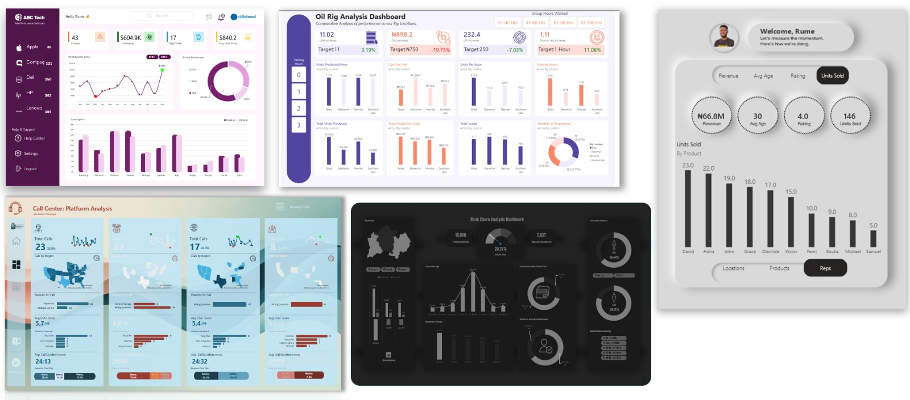
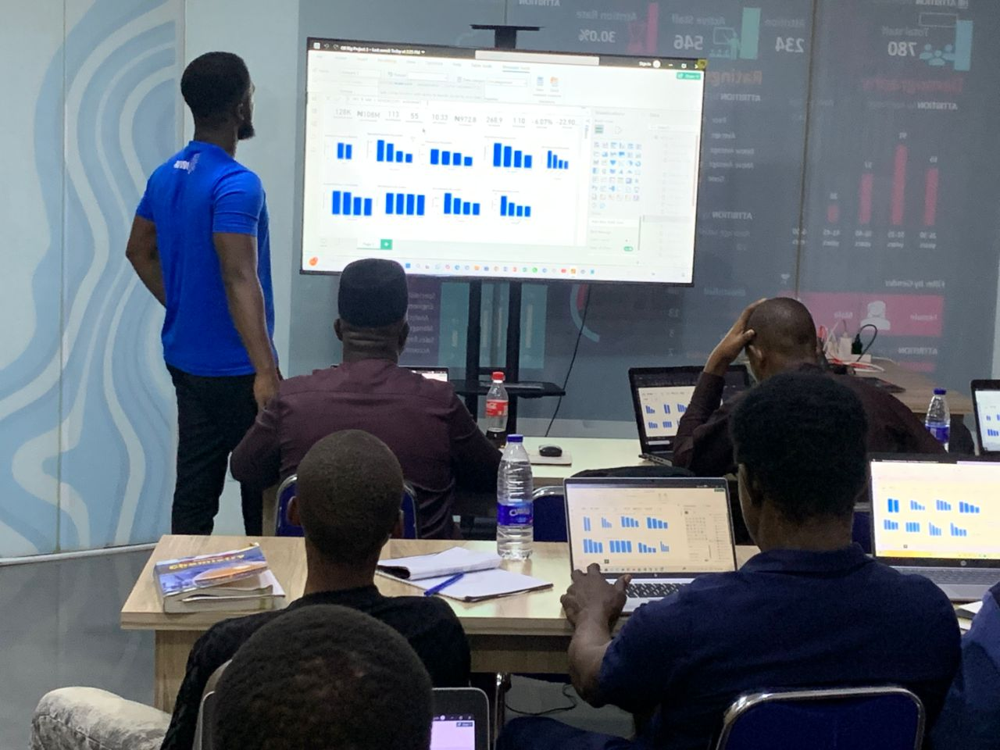

## About
Hello,
I am Rume Eburu a data analyst and problem solver passionate about helping businesses grow using data. Through my work with one of the top Data Analytics Institutes worldwide, Skillahead Academy, I empower data professionals to become confident analysts. I aspire to lead a data consultancy helping African businesses make smarter decisions. I have has trained over 500+ students and built data dashboards, that increases team productivity by a huge margin.

## Skills
### Data Visualization & Reporting (Power BI, Excel, SQL)
I really shiine in creating clean, minimalist dashboards with a strong focus on KPIs  that help stakeholders make fast, accurate decisions. [Check out a few here](https://www.linkedin.com/posts/rumeeburu_data-analytics-uiux-a-friend-of-mine-activity-7367098529493770241-va1V?) 

### Training & Analyst Mentorship
One of the things that I also do so well is that I train and mentor aspiring analysts through real-world projects, simple explanations, and practical thinking. [View my trainings](https://www.linkedin.com/posts/rumeeburu_our-4-week-data-analytics-training-usually-activity-7393307457403392001-YgIi?) 

### Course Content Creation
Rume also develops practical data analytics courses and YouTube tutorials that simplify complex concepts into real-world skills. [View my tutorials](https://www.youtube.com/@rumeeburu3648/videos) 

