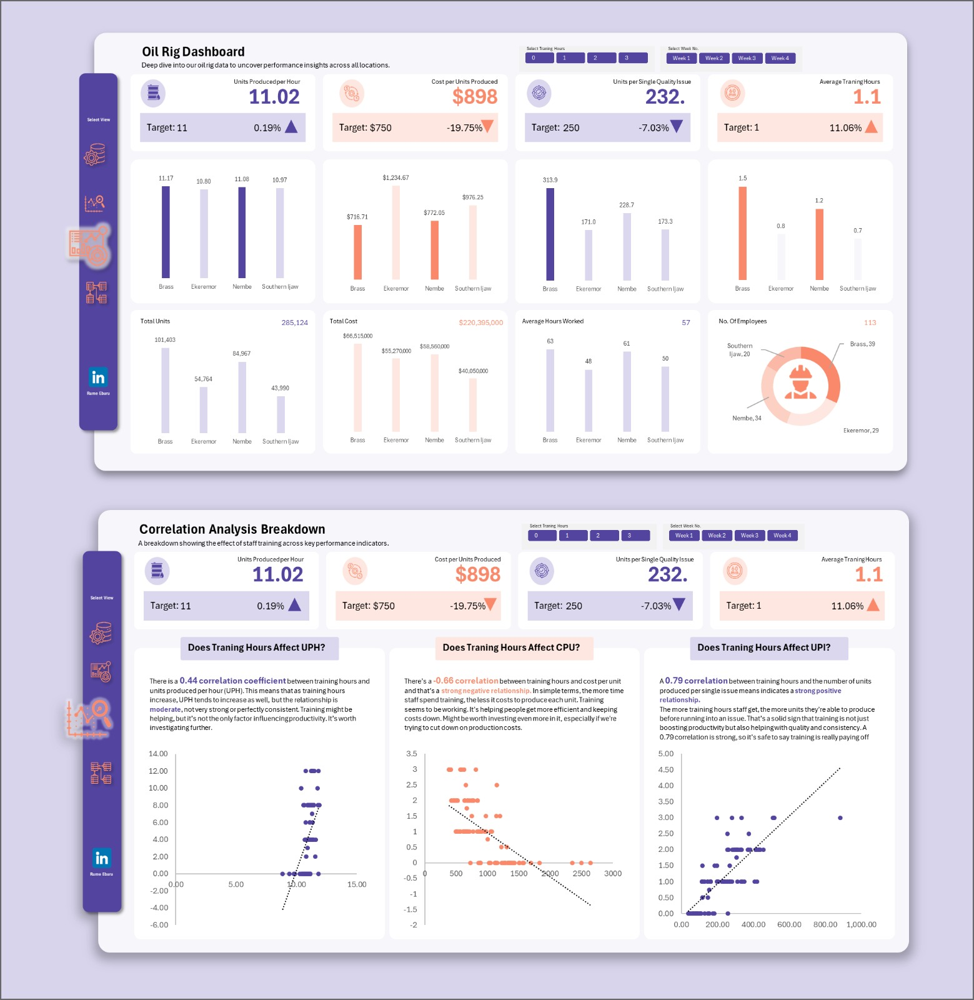

## About
Hello,
I am Rume Eburu, a data analyst and problem solver passionate about helping businesses grow using data. Through my work with one of the top Data Analytics Institutes worldwide, [Skillahead Academy](https://www.linkedin.com/company/skillahead/posts/?feedView=all), I empower data professionals to become confident analysts. I aspire to lead a data consultancy helping African businesses make smarter decisions. I have trained over 500+ students and built data dashboards that increase team productivity by a huge margin.

## Skills
### Data Visualization & Reporting (Power BI, Excel, SQL)
I really shine in creating clean, minimalist dashboards with a strong focus on KPIs  that help stakeholders make fast, accurate decisions. [Check out a few here](https://www.linkedin.com/posts/rumeeburu_data-analytics-uiux-a-friend-of-mine-activity-7367098529493770241-va1V?) 

### Training & Analyst Mentorship
One of the things that I also do so well is train and mentor aspiring analysts through real-world projects, simple explanations, and practical thinking. [View my trainings](https://www.linkedin.com/posts/rumeeburu_our-4-week-data-analytics-training-usually-activity-7393307457403392001-YgIi?utm_source=share&utm_medium=member_desktop&rcm=ACoAAC4MlUQBY3VPNFFLDx9hkaannILzXsKcSxA) 

### Course Content Creation
I also develop practical data analytics courses and YouTube tutorials that simplify complex data concepts, helping data professionals thrive in their space. [View my tutorials](https://www.youtube.com/@rumeeburu3648/videos) 

## My Projects
### WellLife General Hospital – Patient Admissions Analysis (2021–2024)

I analyzed 10,000 patient admissions (2021–2024) for WellLife General Hospital. While malaria and typhoid dominated previous years, 2024 showed a rise in hypertension and stroke cases, with typhoid dropping off entirely. My insights guided the hospital to reallocate resources and shift from general to specialized care, preventing wasteful spending on outdated patient trends. [View Report Here](https://drive.google.com/file/d/1xgE8QB28VsKZN-lgD-HtnImx9Gz8qvYh/view?usp=sharing)

### Automated (Production Tracker)

I developed an automated variance analysis tracker to monitor rig locations against production targets. Investigation revealed that only one location consistently met goals, with training hours directly affecting output. My tracker automated reporting, enabling weekly monitoring, better training allocation, and improved production across all sites. [View Report Here](https://docs.google.com/spreadsheets/d/1eqpYR7A_cGHYDZ0blQFnAmbMly2OvsuJ/edit?usp=sharing&ouid=117985651197630752603&rtpof=true&sd=true)

## Contact Me

[Phone](+2349050220346)
[Linkedin](www.linkedin.com/in/rumeeburu)
[Mail](rume964@gmail.com)
[Download my CV](https://drive.google.com/drive/folders/1fCHwBVYkf7W2qlezWjQ5LIwoyyYZPKHw)

